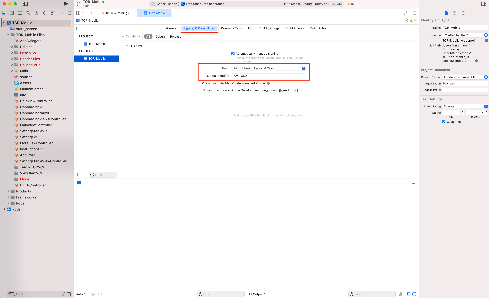
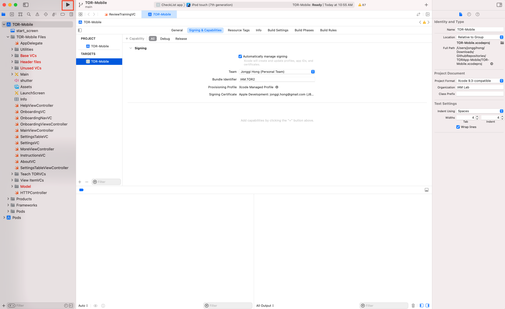
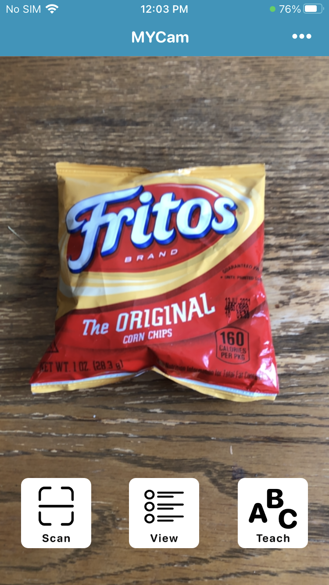
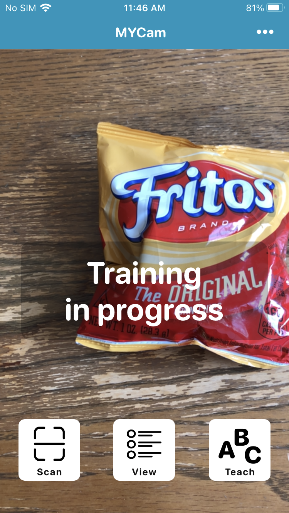
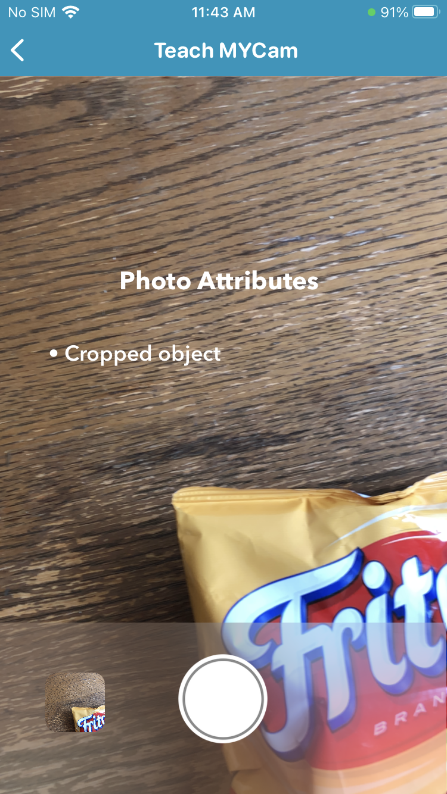
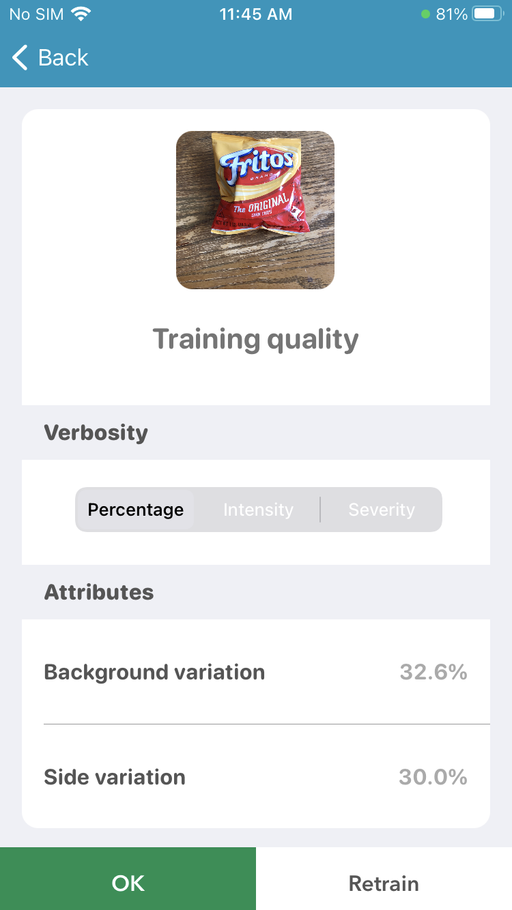
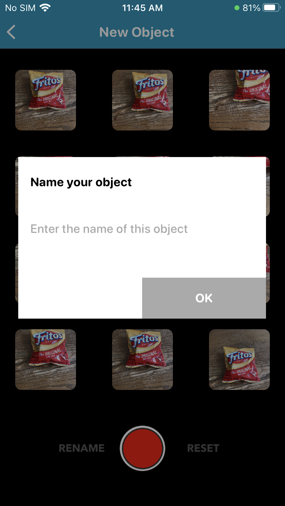
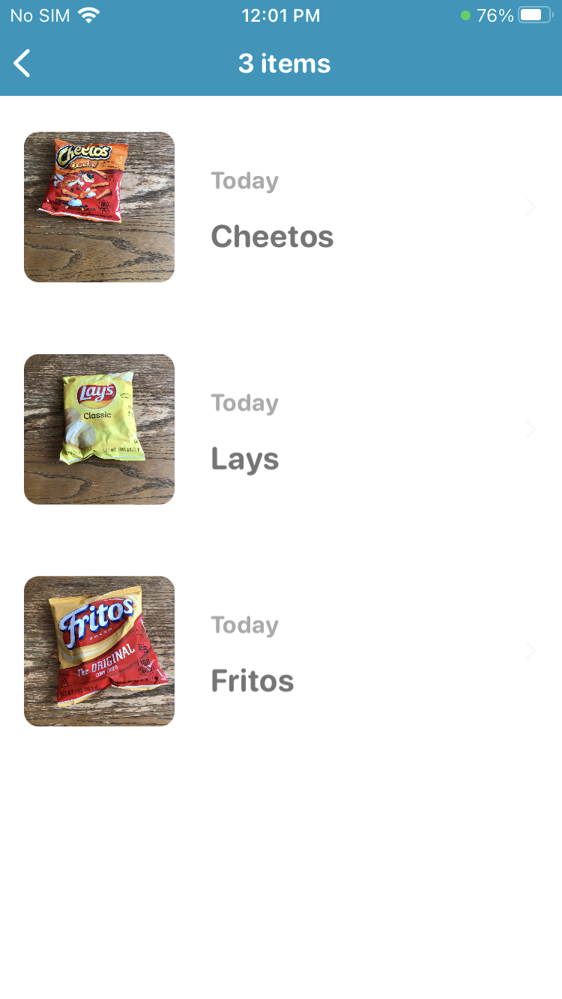
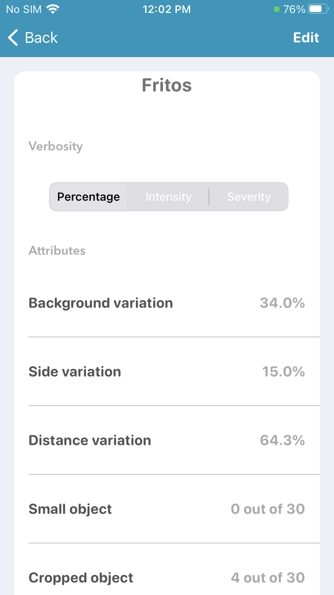
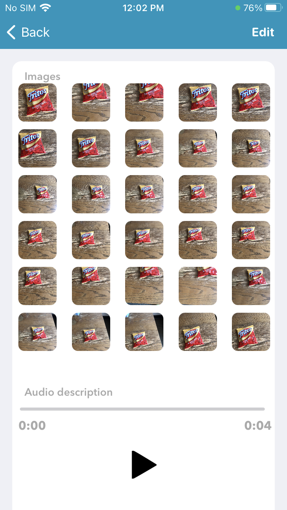

# TOR Mobile Application
<a href="https://jonggi.github.io"></a>
<a href="LICENSE.md"></a>
 


The Swift 4.0 codes of the TOR app. The TOR mobile application includes user interfaces and communication with the Amorgos server in the IAM Lab.
The user interfaces consists of main screen, training, scanning, and a list of items as shown below. The user interface of the app was designed based on the screen size of iPhone 8.

<p align="center">
  
</p>

## Requirements
In order to run the TOR app, you will need to meet the following requirements:
```
- A Mac with Xcode 13.0 or later
- Git command line tools or a git source control client like Tower. 
- iOS 12.1 or later
- Download and run the TOR Server codes
```
TOR Server codes are [here](https://github.com/IAMLabUMD/TORApp-Server).

## Getting started
To build and run the TOR app, please follow these steps,
1. Clone the repository
```
   git clone https://github.com/IAMLabUMD/TORApp-Mobile.git
```
2. Open the project in Xcode by selecting `TOR-Mobile.xcworkspace`
3. Set your Apple account as a developer of the app in the Signing & Capabilities tab. Add and select your Apple account for 'Team' and use any name for 'Bundle identifier' (see the example below).

<p align="center">
  
</p>

4. Connect an iPhone to your computer
5. Run the app

<p align="center">
  
</p>

## Structure of the app
The source codes are organized based on their functionalities (i.e., main screen, teach, scan, list of items, communication with the server, and logging). 

### Main screen
`MainViewController.swift`

 

 


### Teach
`Teach TORVCs/ARViewController.swift`

`Teach TORVCs/ReviewTraining.swift`

`Teach TORVCs/TrainingVC.swift`

  

### Scan
`MainViewController.swift` (selecting the scan item button on the main screen)


### List of items
`View ItemVCs/ChecklistViewController2.swift`

`View ItemVCs/ItemAttrAndInfoVC.swift`

  

### Communication with the server
`Model/HTTPController.swift`: a class with functions to communicate with the Amorgos server (e.g., send an image, receiving the attributes of photos from the server)

### Logging
`Utilities/Log.swift`: logging the users' actions

## Publications
Under review

## Contact
Jonggi Hong <jhong12@umd.edu>

Ernest Essuah Mensah <ernest.mensah27@icloud.com>

Hernisa Kacorri <hernisa@umd.edu>